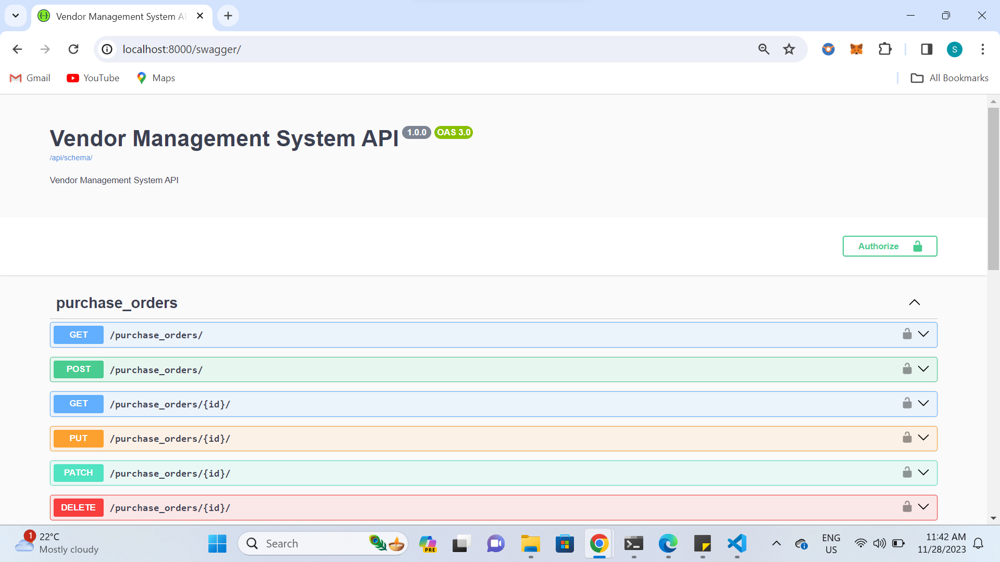
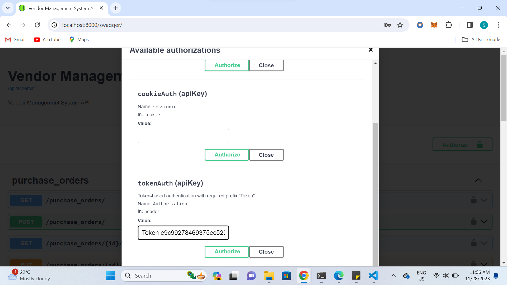
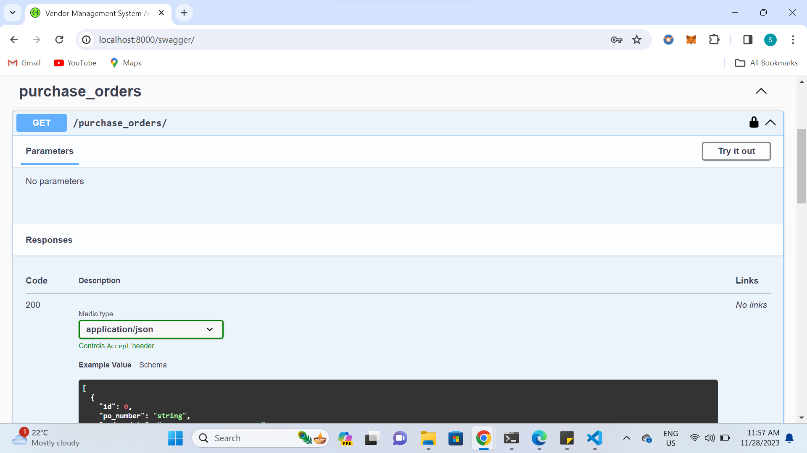

# Vendor-Management-System-with-Performance-Metrics
Vendor Management System using Django and Django REST Framework. This system will handle vendor profiles, track purchase orders, and calculate vendor performance metrics.

*Login Credentials:*
```
username: admin
password: admin
```


## Features
* Create, update, and delete vendors
* Create, update, and delete purchase orders
* Calculate vendor performance metrics


## Getting Started
### Virtual Environment
It is recommended to use a virtual environment to run this project. To create a virtual environment, run the following command:
```
python -m venv venv
```
To activate the virtual environment, run the following command(Linux):
```
source venv/bin/activate
```
(Windows):
```
venv\Scripts\activate
```

To deactivate the virtual environment, run the following command (Linux/Windows):
```
deactivate
```


### Installing

1. Clone the repository
```
git clone https://github.com/Sarveshk76/Vendor-Management-System-with-Performance-Metrics.git
```
2. Install the required packages
```
pip install -r requirements.txt
```
3. Run the server
```
python manage.py runserver
```
4. Open the browser and go to http://localhost:8000

## Built With

* [Django](https://www.djangoproject.com/) - The web framework used
* [Django REST Framework](http://www.django-rest-framework.org/) - The REST API framework used

## API Endpoints

### Vendor

* GET /api/vendors/ - List all vendors
* POST /api/vendors/ - Create a new vendor
* GET /api/vendors/{id}/ - Retrieve a vendor
* PUT /api/vendors/{id}/ - Update a vendor
* DELETE /api/vendors/{id}/ - Delete a vendor

### Purchase Order

* GET /api/purchase_orders/ - List all purchase orders
* POST /api/purchase_orders/ - Create a new purchase order
* GET /api/purchase_orders/{id}/ - Retrieve a purchase order
* PUT /api/purchase_orders/{id}/ - Update a purchase order
* DELETE /api/purchase_orders/{id}/ - Delete a purchase order

### Vendor Performance

* GET /api/vendor_performance/ - List all vendor performances


### Use Swagger UI to test the API

* Go to http://localhost:8000/swagger/

* Click on "Authorize" button on the top right corner

* Enter the following credentials:
```
tokenAuth (apiKey) : "Token e9c99278469375ec523d76d38ae2c33cb9d8a3b3"
```
and click on "Authorize" button

* Now you can test the API. Click on any endpoint and then click on "Try it out" button. Enter the required parameters and click on "Execute" button.

## Screenshots




## Test Suite

To run the test suite, run the following command:
```
python manage.py test
```

